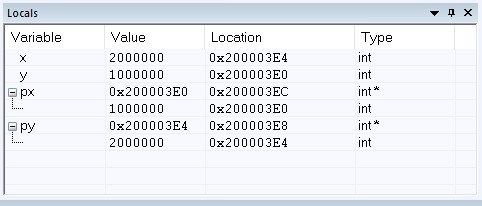

1a) In the main function, setup pointers to pass them to the swap_pointer() function and swap_pointer() function
    takes pointer to pointer arguments.

1b) R0 = 0x200003EC, R1 = 0x200003E8

1c) This is the screenshot of local variables in main()
    
    